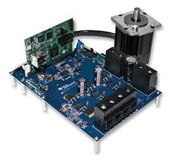
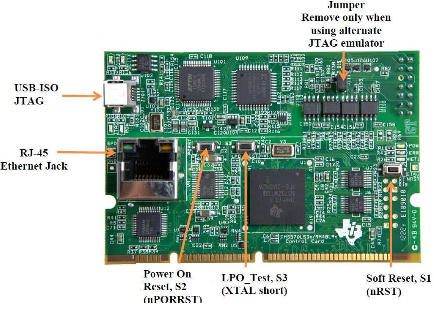

# Идентификационная информация
## Название
Лабораторная работа №10 для настройки контура поддержания угловой скорости

# Соглашения по используемому оформлению
Вынесены в отдельный [**файл**](соглашения.md).

# Используемые сокращения
Вынесены в отдельный [**файл**](сокращения.md).

# Цели лабораторной работы №10

* ознакомиться с модулем "параллельного" ПИ-регулятора
* получить информацию о настройки ПИ-регулятора угловой скорости методом проб и ошибок
* узнать о принципиальной возможности настройки коэффициентов ПИ-регуляторов тока и ПИ-регулятора угловой скорости при известных характеристиках системы
* произвести настройку коэффициентов ПИ-регулятора угловой скорости по методике, изложенной в [лабораторной работе №5b](reference/instaspin_labs.pdf) от Texas Instruments

# Изделие
Инструмент управления бесколлекторным электродвигателем, состоящий из [**DRV8301-HC-EVM rev.D**](http://www.ti.com/tool/DRV8301-HC-C2-KIT) (ссылка ведёт на такой же оценочный модуль, но с другой управляющей платой; оценочный модуль отдельно не продаётся) и [**RM48 CNCD**](http://processors.wiki.ti.com/index.php/RM48_CNCD).

# Дополнительное описание
В случае срабатывания токовой защиты и отключения силовой части ЭД можно ввести команду **menable**, которая произведёт сброс драйвера DRV8301.

Сохранён модуль логгирования данных, который можно использовать как в старой функциональности, так и для проверки регулятора угловой скорости.

В команду **mmode** добавлен новый алгоритм работы ЭД: режим №5 (**MODE\_CLOSE\_SPEED\_LOOP**) замыкает обратную связь по угловой скорости.

	enum WORK_MODE {
		MODE_OFF,
		MODE_ENCODER_CALIBRATION,
		MODE_GENERATE_ANGLE,
		MODE_TRANSLATE_I_ALPHA_BETA,
		MODE_TRANSLATE_V_DQ,
		MODE_CLOSE_CURRENT_LOOP,
		MODE_CLOSE_SPEED_LOOP,
	};

Опорная величина угловой скорости задаётся с помощью команды **mw** (в электрических [об/мин]). Если активен режим поддержания угловой скорости, то изменение скорости начнётся сейчас же, в противном случае необходимо ввести команду **mwon** или **mmode 6**.

Для удобства настройки ПИ-регулятора угловой скорости добавлены команды **mwki**, **mwkp** для изменения коэффициента П- и И-звеньев регулятора угловой скорости. Безударное переключение при изменении коэффициента при И-звене обеспечивается самой природой "параллельного" ПИ-регулятора; именно для этого он и выбран.

Команда **mwon** устанавливает режим поддержания угловой скорости и включает модуль логгирования. При активном режиме поддержания угловой скорости команда **mwon** перезапускает модуль логгирования.

Для облегчения кода из модуля мотора удалено API для задания других режимов работы ЭД. Также удалены соответствующие команды монитора-отладчика.

Доступны следующие команды монитора-отладчика:

- drv8301
- mchl
- menable
- mlogcnt
- mlogsave
- mlogshow
- mmode
- mw
- mwki
- mwkp
- mwon
- showcurrents

Режим работы ЭД с замкнутым контуром поддержания тока реализуется в функции *runPiSpeedController()* модуля мотора ***src/Motor/motorNew.cpp***:

~~~C++
static void runPiSpeedController()
{
    const auto Id = Idq.value[0];
    const auto Iq = Idq.value[1];
    const auto Vd_pu = pi::runSeries(pidId, targetId_A, Id);
    const auto Vq_pu = pi::runSeries(pidIq, targetIq_A, Iq);
    Vdq = {Vd_pu, Vq_pu};
    inversePark = ::ipark::run(phasorEncoder, Vdq);
}
~~~

# Выполнение лабораторной работы

## Цель №1: ознакомиться с модулем ПИ-регулятора

Добавлен программный модуль ***src/Motor/modules/pi/pi.cpp***, который реализует так называемый "последовательный" пропорционально-интегральный регулятор. API для данного модуля позволяет использовать как ссылочный тип, так и указатель.

Последовательный ПИ-регулятор:

Используемый модуль ПИ-регулятора производит ограничение до предельного значения как выходного значения регулятора, так и интегральной составляющей. Это предельное значение задаётся пользователем путём вызова соответствующего API.

    namespace pi {
    void setMinMax(PiRegul&, const float outMin, const float outMax);
    void setMinMax(PiRegul*, const float outMin, const float outMax);
    } /* namespace pi */

Для настройки коэффициентов ПИ-регулятора необходимо использовать или аналитические методы расчёта, или практические результаты. В любом случае для анализа корректности коэффициентов в "железе" требуется визуализация работы регулятора на частоте ШИМ. Данные для визуализации можно получить, используя методы из лабораторной работы №8.

## Цель №2: настроить коэффициенты ПИ-регулятора тока для применённого ЭД

В функции *motorNew::create()* производится инициализация ПИ-регуляторов тока по каналам Id, Iq:

~~~C++
void create(
        const het::HET nHet,
        const uint32_t startAddr,
        const PinsMotorInHet& mpins)
{
	....
	
    pidId = pi::create();
    pidIq = pi::create();
    constexpr float kp = 0.17F;
    constexpr float ki = 0.002F;
    pi::setGains(pidId, kp, ki);
    pi::setGains(pidIq, kp, ki);
    pi::setMinMax(pidId, -1.0F, 1.0F);
    pi::setMinMax(pidIq, -1.0F, 1.0F);

	....
}
~~~

Измените значение kp на 0.05, ki на 0.001.

Введите **make**. После успешной компиляции подключите электрический двигатель (обмотки, энкодер), подключите кабель к отладчику XDS100v2 в составе RM48CTRLCD, подключите JLink, подайте питание, запустите ***runFromRam-release-jlink.cmd***, затем ***runDCC.cmd***. Откройте отладочный терминал. Откройте приложение для визуализации графических данных, в нём отметьте первые 2 канала. Последовательно введите команды **mrefid 1**, **mchl 0 3**, **mchl 1 5**, **mfocon**, **mlogsave**. В программе визуализации должен появиться график работы ПИ-регулятора тока Id; число выводимых точек задаётся модулем **LogPoint**. Так как установлены небольшие коэффициенты kp и ki, то выход регулятора выдаёт очень низкие значения, и ток не приближается к заданию. Далее можно последовательно увеличивать kp, перекомпилируя при этом программу (и загружая её в ОЗУ). Последовательно вводя все вышеописанные команды после каждой загрузки в ОЗУ, нужно добиться такого коэффициента kp, чтобы в программе визуализации выбег составлял не более 5%. Для проверки можно использовать другое значение задаваемого тока.

Таким образом производится настройка коэффициента kp.

После предварительной настройки коэффициента kp, можно немного поднимать коэффициент ki, так, чтобы ток достигал требуемого значения за нужное пользователю число тактов ШИМ.

Введя команды **mrefid 0** и **mrefiq 0.5**, пользователь задаст значение Id = 0, Iq = 0.5 Ампер. Это должно привести к вращению ЭД и его раскрутке до большой скорости (в максимальной степени ограничиваемой обратной ЭДС и в минимальной степени ограничиваемой током Iq).

## Цель №3: ознакомиться с особенностями применяемого ЭД

В процессе настройки регуляторов было отмечено странное поведение ЭД.

При установке тока Iq=0.3А и блокировании ротора руками неоднократно отмечалась ситуация, когда ротор ЭД после разблокирования не начинал вращаться. Странно: 1) создаваемый в статоре ток повёрнут относительно ротора на 90&deg; эл. (что приводит к максимально возможному моменту при любом токе статора); 2) ЭД не вращается при достаточно высоком токе; 3) после небольшой помощи руками для вращения ротора скорость вращения быстро становится достаточно высокой.

Я предполагаю, что это влияние зубчатого момента, но надо будет уточнить у экспертов.

Это значит, что для старта вращения ЭД нужно будет подать ток существенно выше рабочего тока, если ротор не нагружен. Затем контур замыкания угловой скорости должен снизить ток Iq.

## Цель №4: произвести настройку коэффициентов ПИ-регулятора по методике Texas Instruments

На стр. 97 даны формулы:

$Ki_{series} = \frac{R}{L}$

$Kp_{series} = L \times Bandwidth$

С учётом перевода непрерывной аналоговой области в цифровую дискретную область, получим:

$Ki_{series\_discrete} = \frac{R}{L} \times Ti$

Для [используемого ЭД M-2310P-LN-04K](reference\N23\_Industrial\_Grade\_Motors\_v6.3.pdf): R = 0.72&Omega;, L = 0.4 мГн.

При частоте запуска контура поддержания тока равной частоте ШИМ (20 кГц) получим Ti = 0.00005 с.

$Ki_{series} = 0.00005 \times \frac{0.72}{0.0004} = 0.09$

Начнём с использования полосы равной 1/20 от частоты контура поддержания тока.

$Kp_{series} = 0.0004 \times \pi \times \frac{20000}{20} = 2.51$

Так как выход регулятора подаётся через преобразования Парка на вход векторной ШИМ и на входе векторной ШИМ ожидаются значения [0..1] (числу "1" будет соответствовать полный размах питания), то следует учесть напряжение питания равное 24 Вольта: 

$Kp_{series\_pu} = \frac{Kp_{series}}{U} = \frac{2.51}{24V} = 0.105$

Полученные значения приводят к нормальной работе регуляторов тока.

Вот несколько полученных графиков достижения тока. Первые два графика построены для регулятора тока Id, при этом Iq = 0 (то есть ротор не вращается). Третий график построен при Id = 0 (то есть производится вращение ротора).

